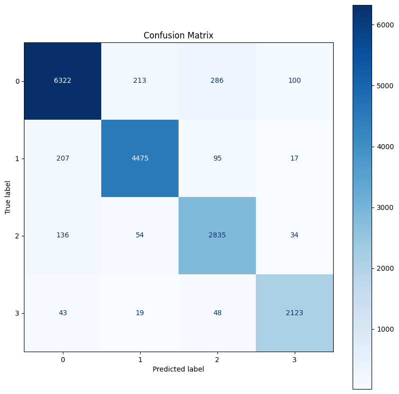

# Word Embeddings

> This repo contains the work done in the Practica 4 of the PLH (NLP) course of the Artificial Intelligence Degree at UPC

## Table of Contents

- [Word Embeddings](#word-embeddings)
  - [Table of Contents](#table-of-contents)
  - [Overview](#overview)
  - [Data sources](#data-sources)
  - [Model sources](#model-sources)
  - [File structure](#file-structure)
    - [Description of files and folders](#description-of-files-and-folders)
  - [Requeriments](#requeriments)
  - [Results and examples](#results-and-examples)
    - [Part 1](#part-1)
    - [Part 2](#part-2)
    - [Part 3](#part-3)

## Overview

Word embeddings are a very important part of NLP tasks. They can be used for a wide range of tasks, from text similarity to text classification...

Over the years, many different models of creating word embeddings have appeared. The initial ones were based on things like a tfidf matrix, but the newer ones use complex structures like autoencoders and transformers to get the most information about the textual data.

In this project, we have worked with the vector representations in different ways. In part 1, we trained some CBOW and Word2Vec models with different data sizes, and compared them using different metrics. Part 2 uses some of those vectors, with others from pretrained models, to create various sentence text similarity models and analyze the results. Two finetuned models have also been developed for this task. In part 3, we observe a little example for another task, this time text classification.

This models have been developed in Catalan, which adds some more depth since it isn't a big language.

## Data sources

The data we used came mostly from HuggingFace, specifically from the project-AINA. Specially, we have used the [catalan-general-crawling](https://huggingface.co/datasets/projecte-aina/catalan_general_crawling) and the [semantic-text-similarity](https://huggingface.co/datasets/projecte-aina/sts-ca)

## Model sources

We have also used some pretrained models. Two of them are RoBERTa models from projecte AINA: [roberta-base-ca](https://huggingface.co/projecte-aina/roberta-base-ca-v2) and [roberta-finetuned-sts](https://huggingface.co/projecte-aina/roberta-base-ca-v2-cased-sts). We have also used a Word2Vec model from [nlpl](http://vectors.nlpl.eu/repository/) and cc.ca.300 from [fasttext](https://fasttext.cc/docs/en/crawl-vectors.html).

Our own finetuned models can be found at HuggingFace: [finetuned-mpnet](https://huggingface.co/pauhidalgoo/finetuned-sts-ca-mpnet-base) and [finetuned-roberta-ca](https://huggingface.co/pauhidalgoo/finetuned-sts-roberta-base-ca-v2). This process was done using Google Collab.

## File structure
The file and folder structure is the following:

    ├── data
    ├── models
    ├── results
    │   ├── plots
    │   ├── evaluation_results_filtered.csv
    |   ├── evaluation_results.csv
    |   ├── similarity_results_finetuned.csv
    │   └── similarity_results.csv
    ├── classification_word2vec.py
    ├── evaluate_models.py
    ├── functions.py
    ├── tensorflow_models.py
    ├── texsim_class.py
    ├── word_vectorizer.py
    ├── finetuning.ipynb
    ├── optional.ipynb
    ├── part1.ipynb
    ├── part2.ipynb
    ├── plot_textsim.ipynb
    └── ultra_updated_data.RData

### Description of files and folders

- **Data**: mapped pairs (to avoid recomputing) in pkl format and some txt files for evaluation
- **Models**: folder that contains the trained word2vec and CBOW models. Since they are too big for GitHub, it doesn't exist here.
- **Results**: Results of the part 1 and part 2
  - `evaluaton_results`: Part 1 results of word2vec evaluations
  - `similarity_results`: Part 2 results of semantinc text similarity models
- `classifcation_word2vec.py`: File with ClassificationWord2Vec class implementation (part 3)
- `evaluate_models.py`: w2v evaluation tools (part 1)
- `finetuning.ipynb`: notebook used for sts finetuning (part 2)
- `functions.py`: auxiliar functions for part 1
- `optional.ipynb`: part 3 implementation
- `part1.ipynb`: part 1 implementation
- `part2.ipynb`: part 2 implementation
- `plot_textsim.ipynb`: notebook with results of part 2
- `tensorflow_models.py`: models defined in part 2
- `textsim_class`: text similarity class used in part 2
- `word_vectorizer`: class used in part 1

## Requeriments

The requeriments of the libraries are in the `requirements.txt` file.

To execute the code, we recomend using at least a computer with 12 threads and 16gb of RAM. To use Spacy, it's better to also 
have GPU. The same occurs for finetuning, which has been done in Google Collab.

## Results and examples

### Part 1

| Model                                        | Avg. Statistic | Pearson  | Spearman | OOV Perc. | Pearson p-value    | Spearman p-value   |
|----------------------------------------------|----------------|----------|----------|-----------|---------------------|---------------------|
| w2v_sg_300_win10_nltk_cat_gc_1000mb.model    | 0.5884         | 0.5733   | 0.6036   | 0.4525    | 1.29e-20            | 3.20e-23            |
| w2v_sg_300_win10_spacy_cat_gc_1000mb.model   | 0.5844         | 0.5693   | 0.5995   | 1.3575    | 3.98e-20            | 1.16e-22            |
| w2v_sg_100_win10_nltk_cat_gc_1000mb.model    | 0.5643         | 0.5523   | 0.5763   | 0.4525    | 5.80e-19            | 7.20e-21            |
| w2v_sg_100_win10_spacy_cat_gc_1000mb.model   | 0.5601         | 0.5491   | 0.5711   | 1.3575    | 1.44e-18            | 2.87e-20            |
| w2v_sg_100_win10_nltk_cat_gc_maxmb.model     | 0.5474         | 0.5363   | 0.5584   | 0.4525    | 8.81e-18            | 1.95e-19            |
| w2v_sg_100_spacy_cat_gc_1000mb.model         | 0.5445         | 0.5314   | 0.5576   | 1.3575    | 2.75e-17            | 3.28e-19            |
| w2v_sg_100_win10_spacy_cat_gc_500mb.model    | 0.5314         | 0.5155   | 0.5473   | 1.3575    | 3.39e-16            | 1.96e-18            |
| w2v_sg_100_win10_nltk_cat_gc_500mb.model     | 0.5284         | 0.5095   | 0.5473   | 1.3575    | 8.46e-16            | 1.97e-18            |
| w2v_sg_100_nltk_cat_gc_1000mb.model          | 0.5233         | 0.5084   | 0.5383   | 0.4525    | 7.33e-16            | 6.31e-18            |
| w2v_sg_100_win10_nltk_caps_cat_gc_1000mb.model| 0.5225         | 0.5131   | 0.5320   | 0.9050    | 4.18e-16            | 2.13e-17            |

### Part 2

| Model                   | Exec model | Mode           | Train pearson | Val pearson    | Test pearson   | Train spearman | Val spearman   | Test spearman  |
|-------------------------|------------|----------------|---------------|----------------|----------------|----------------|----------------|----------------|
| Roberta finetuned pipe  | 8          | pipe           | 0.9474        | 0.7523         | 0.7819         | 0.9614         | 0.7319         | 0.7993         |
| Roberta own finetuning  | 8          | notebook       | 0.9350        | 0.7185         | 0.7429         | 0.9899         | 0.7312         | 0.7714         |
| MPnet own finetuning    | 8          | notebook       | 0.9370        | 0.5856         | 0.6501         | 0.9918         | 0.5855         | 0.6820         |
| Random                  | 1          | embeddings     | 0.9278        | 0.4956         | 0.5985         | 0.9478         | 0.5121         | 0.6367         |
| Random v2               | 1          | embeddings     | 0.9259        | 0.5005         | 0.5932         | 0.9470         | 0.5337         | 0.6403         |
| Roberta hugging mean    | 1          | roberta-hugging| 0.9628        | 0.4975         | 0.5597         | 0.9853         | 0.4976         | 0.5936         |
| Roberta hugging mean    | 5          | roberta-hugging| 0.5667        | 0.5394         | 0.5504         | 0.5703         | 0.5378         | 0.6102         |
| Roberta hugging mean    | Baseline   | roberta-hugging| 0.5583        | 0.5337         | 0.5449         | 0.5799         | 0.5329         | 0.6074         |
| Roberta mean            | 1          | roberta        | 0.9256        | 0.4071         | 0.5419         | 0.9731         | 0.4218         | 0.5745         |
| Initialized w2v propi notrain | 0     | embeddings     | 0.6546        | 0.5099         | 0.5396         | 0.6475         | 0.4820         | 0.5281         |
| Word2vec propi tfidf    | 1          | tfidf          | 0.8311        | 0.4746         | 0.5395         | 0.8692         | 0.4722         | 0.5718         |

### Part 3

